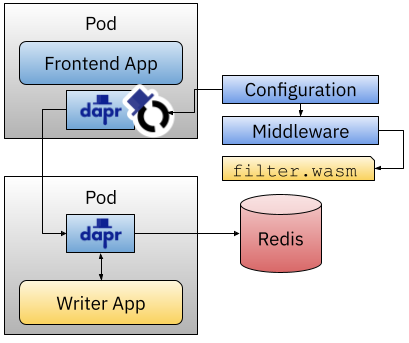

# Dapr + WebAssembly + Wazero :: Step-by-step tutorial - KubeCon EU 2023

[Safe, Dynamic Middleware with Dapr and WebAssembly](https://sched.co/1HyW0)

On this step-by-step tutorial we will install Dapr into a Kubernetes Cluster, install four application  applications that use Dapr Components to interact with available infrastructure. Once we get things working we will use the Dapr Middleware Compponent that integrates with the Wazero Runtime to customize how the application behaves by extending the infrastructure.


This tutorial is divided into three parts: 
- [Prerequisites and Installation](#pre-requisites-and-installation)
- [Installing the Applications and wiring things together](#installing-the-applications-and-wiring-things-together)
- [Extending Infrastructure with Wazero and WebAssembly](#extending-infrastructure-with-wazero-and-webassembly)

## Pre requisites and installation

We will be creating a local Kubernetes Cluster using KinD, installing Dapr and Redis using Helm. 
You will need to install KinD, `kubectl` and `helm` in your workstation. Then you can run the following commands: 

Create a local Kubernetes cluster with: 
```
kind create cluster
```

You should see something like this: 
```
Creating cluster "kind" ...
 ✓ Ensuring node image (kindest/node:v1.25.3) 🖼 
 ✓ Preparing nodes 📦  
 ✓ Writing configuration 📜 
 ✓ Starting control-plane 🕹️ 
 ✓ Installing CNI 🔌 
 ✓ Installing StorageClass 💾 
Set kubectl context to "kind-kind"
You can now use your cluster with:

kubectl cluster-info --context kind-kind

Have a nice day! 👋
```

Let's create a Redis instance that our applications can use to store state or exchange messages: 

```
helm repo add bitnami https://charts.bitnami.com/bitnami
helm repo update                            
helm install redis bitnami/redis --set image.tag=6.2 --set architecture=standalone
```
You should see something like this: 

```
NAME: redis
LAST DEPLOYED: Sat Apr  8 08:59:03 2023
NAMESPACE: default
STATUS: deployed
REVISION: 1
TEST SUITE: None
NOTES:
CHART NAME: redis
CHART VERSION: 17.9.3
APP VERSION: 7.0.10
... (Long set of instructions here) ...
```

Finally, let's install Dapr into the Cluster: 

```
helm repo add dapr https://dapr.github.io/helm-charts/
helm repo update
helm upgrade --install dapr dapr/dapr \
--version=1.10.4 \
--namespace dapr-system \
--create-namespace \
--wait
```

After a while (notice the --wait flag) You should see something like this: 

```
NAME: dapr
LAST DEPLOYED: Sat Apr  8 08:59:42 2023
NAMESPACE: dapr-system
STATUS: deployed
REVISION: 1
TEST SUITE: None
NOTES:
Thank you for installing Dapr: High-performance, lightweight serverless runtime for cloud and edge

Your release is named dapr.

To get started with Dapr, we recommend using our quickstarts:
https://github.com/dapr/quickstarts

For more information on running Dapr, visit:
https://dapr.io
```

Let's now install our applications. 

## Installing the Applications and wiring things together

In this section, we will be deploying four applications that want to store and read data from a state store and publish and consume messages. Finally, a Frontend application that interact with all the backend services. 


We will be using Dapr to abstract away the application infrastructure choices. We will be using Redis for both our StateStore and our PubSub component to simplify the setup and reduce the resource consumption. 

Before deploying our applications let's configure these components to connect the Redis instance that we created before. 

The Dapr Statestore configuration looks like this: 
```
kind: Component
metadata:
  name: statestore
spec:
  type: state.redis
  version: v1
  metadata:
  - name: keyPrefix
    value: name
  - name: redisHost
    value: redis-master:6379
  - name: redisPassword
    secretKeyRef:
      name: redis
      key: redis-password
auth:
  secretStore: kubernetes
```

We can apply this resource to Kubernetes by running: 
```
kubectl apply -f resources/statestore.yaml
```

The PubSub Component looks like this: 
```
apiVersion: dapr.io/v1alpha1
kind: Component
metadata:
  name: notifications-pubsub
spec:
  type: pubsub.redis
  version: v1
  metadata:
  - name: redisHost
    value: redis-master:6379
  - name: redisPassword
    secretKeyRef:
      name: redis
      key: redis-password
auth:
  secretStore: kubernetes
```

We can apply this resource to Kubernetes by running: 
```
kubectl apply -f resources/pubsub.yaml
```

Once we have the PubSub component configured, we can register Subscritions to define who and where notifications will be sent when new messages arrive to a certain topic. A Subscription resource look like this: 

```
apiVersion: dapr.io/v1alpha1
kind: Subscription
metadata:
  name: notifications-subscritpion
spec:
  topic: notifications 
  route: /notifications
  pubsubname: notifications-pubsub
```

You can apply this `Subscription` by running: 

```
kubectl apply -f resources/subscription.yaml
```

Finally, let's deploy three applications that uses the Dapr StateStore and PubSub components. This are normal/regular Kubernetes applications, using Kubernetes `Deployments`. To make these apps Dapr-aware we just need to add some Dapr annotations, for example for the `Read App`:

```
annotations:
  dapr.io/app-id: read-app
  dapr.io/app-port: "8080"
  dapr.io/enabled: "true"
```

Let's deploy these apps with: 
```
kubectl apply -f resources/apps.yaml
```
Notice that Dapr will create a Kubernetes Service for each Dapr enabled application (the ones containing the Dapr annotations). 


Check that all the pods are up and running: 

```
> kubectl get pods                                      
NAME                                       READY   STATUS    RESTARTS   AGE
frontend-app-deployment-85d9b9d8c8-k4tgg   2/2     Running   0          19s
read-deployment-75c94668dd-8pnfm           2/2     Running   0          10m
redis-master-0                             1/1     Running   0          18m
subcriber-deployment-57df896599-xzlqn      2/2     Running   0          10m
write-deployment-65887d849f-4pgfm          2/2     Running   0          6m6s
```

Notice that all the Dapr-enabled apps have the `daprd` sidecar container running right besides the application container (`READY: 2/2`).

Now you can access the Frontend application by using `kubectl port-forward`:

```
kubectl port-forward svc/frontend-app-service 8080:80
```

And then pointing your browser to [http://localhost:8080](http://localhost:8080)


## Extending Infrastructure with Wazero and WebAssembly

Now that we have our application up and running, let's use Wazero and the [Dapr WASM Middleware Component]() to extend our application infrastructure with a middleware filter.

You can find the [filter source code here](apps/middleware/).

This is a very simple filter gives our messages super powers! By using the [`github.com/enescakir/emoji`](https://github.com/enescakir/emoji) library, it parses and replace emoji 'tags'. 

To apply this filter to the `Frontend App` we need to first compile the filter source code written in Go using `tinyGo` (add link). 

This generates a `.wasm` file that we can run everywhere with any WASM runtime. For this tutorial we will be using the Wazero WebAssembly runtime that is already integrated with Dapr. 

To make this `.wasm` file available in our cluster we will be using Kubernetes `ConfigMaps` which then will be mounted as a volume for the Dapr sidecar to use. 

To configure this new filter we need to define two things: 
- A Dapr Middleware component [`resources/middleware.yaml`](resources/middleware.yaml)
- A Dapr Configuration []`resources/configuration.yaml`](resources/configuration.yaml)

Let's apply these two resources running: 
```
kubectl apply -f resources/middleware.yaml
kubectl apply -f resources/configuration.yaml
```

Once we have the Middleware component and the configuration, we only need to update our `Write App` to use this configuration and make sure that the `filter.wasm` can be accessed by the Dapr sidecar. 

To do this we can create a Kubernetes ConfigMap containing the `filter.wasm` file:

```
kubectl create configmap wasm-filter --from-file=apps/middleware/filter.wasm
```

As a final step, let's link everything together. We need to mount the ConfigMap content into our `Write App` that is going to use the filter and we need to also tell Dapr to mount that volume so it can load the `filter.wasm` file.

You can do this by uncommenting the following lines inside the [`resources/apps.yaml`](resources/apps.yaml) file: 

```
      annotations:  
        dapr.io/app-id: write-app
        dapr.io/app-port: "8080"
        dapr.io/enabled: "true"
        #dapr.io/volume-mounts: "wasm-volume:/mnt/wasm"
        #dapr.io/config: appconfig
    spec:
      # volumes:
      #   - name: wasm-volume
      #     configMap:
      #       name: wasm-filter
      #       items:
      #         - key: filter.wasm
      #           path: filter.wasm
```

Uncomment the lines and reapply the `apps.yaml` file running after you save the changes, or just apply the modified `apps-wasm.yaml` file: 

```
kubectl apply -f resources/apps-wasm.yaml
```



Go back to the application front end and use your favourite emojis! :metal:


# Sum up


